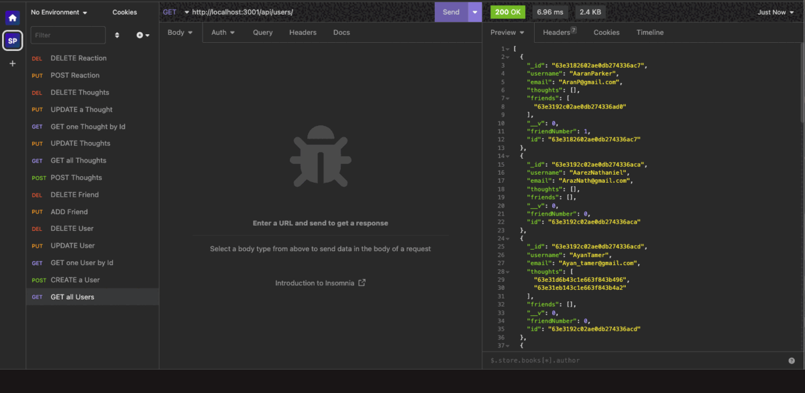

# Global Social


## Description

Global Social is a full-stack API social network web application, so users can share their thoughts, react to friends’ thoughts, and create a friend list.

This app uses `Express.js` for routing, `MongoDB` database, and the `Mongoose ODM`.
After creating an API, a tailor-made database was built using Insomnia.

## Table of Contents

- [Installation](#installation)
- [UserStory](#user-story)
- [Usage](#usage)
- [Credits](#credits)
- [License](#license)
- [Questions](#questions)

## Installation

- [Walkthrough video](https://drive.google.com/file/d/1JlAiD3A1D3PEiaVP5InrYvKoUaECk2uN/view?usp=share_link)

## User Story

```
AS A social media startup
I WANT an API for my social network that uses a NoSQL database
SO THAT my website can handle large amounts of unstructured data
```

## Usage

The following animations show examples of the application's API routes being tested in Insomnia:



## Credits

- [Insomnia](https://insomnia.rest/)
- [MongoDB](https://www.mongodb.com/try/download/compass)
- [UCLA Extension Bootcamp](https://www.uclaextension.edu/?gclid=Cj0KCQiAgribBhDkARIsAASA5btdbwAz8x25r3b1deoRNIGxfkPFL11rAQMuCgQ7HYiqBH8CLr9CgLoaAktlEALw_wcB&gclsrc=aw.ds)

## License

MIT License

Copyright (c) 2023

Permission is hereby granted, free of charge, to any person obtaining a copy
of this software and associated documentation files (the "Software"), to deal
in the Software without restriction, including without limitation the rights
to use, copy, modify, merge, publish, distribute, sublicense, and/or sell
copies of the Software, and to permit persons to whom the Software is
furnished to do so, subject to the following conditions:

The above copyright notice and this permission notice shall be included in all
copies or substantial portions of the Software.

THE SOFTWARE IS PROVIDED "AS IS", WITHOUT WARRANTY OF ANY KIND, EXPRESS OR
IMPLIED, INCLUDING BUT NOT LIMITED TO THE WARRANTIES OF MERCHANTABILITY,
FITNESS FOR A PARTICULAR PURPOSE AND NONINFRINGEMENT. IN NO EVENT SHALL THE
AUTHORS OR COPYRIGHT HOLDERS BE LIABLE FOR ANY CLAIM, DAMAGES OR OTHER
LIABILITY, WHETHER IN AN ACTION OF CONTRACT, TORT OR OTHERWISE, ARISING FROM,
OUT OF OR IN CONNECTION WITH THE SOFTWARE OR THE USE OR OTHER DEALINGS IN THE
SOFTWARE.

## Questions

Reach me at the link below with additional questions:

- Salma Loum: https://github.com/SalmaLoum
